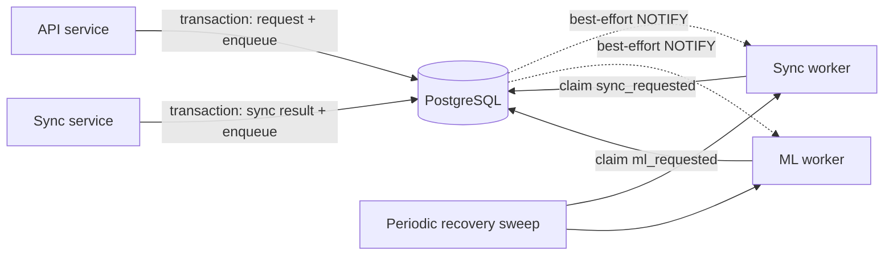
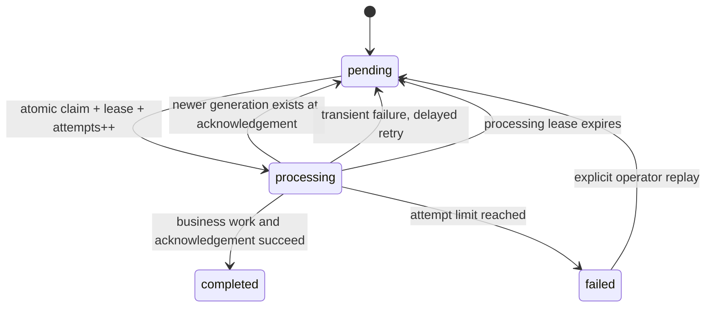

# ADR-0005 Architecture Concept: Inter-Service Work Channel

Date: 2026-08-28
Status: Implemented by [ADR-0005](0005-inter-service-work-channel.md)

## 1. Scope and verified baseline

This concept covers only asynchronous commands between the API, sync-service, and
ml-service. Existing choices for monorepo, FastAPI, PostgreSQL/TimescaleDB, rendering,
authentication, and single-host Docker Compose remain unchanged.

Verified after implementation:

- API writes `users.sync_requested` and enqueues or coalesces `sync_requested` on one
  connection in one explicit transaction.
- sync-service writes `users.ml_requested` and enqueues or coalesces `ml_requested` in one
  explicit transaction.
- Both consumers claim durable jobs using `FOR UPDATE SKIP LOCKED`, recover expired
  processing leases, retry failures, and periodically sweep for missed notifications.
- PostgreSQL `NOTIFY service_events` is emitted after inserts and relevant updates that
  leave an event `pending`.
- Sync and ML event consumers are enabled by default. Setting the respective feature flag
  to `false` activates only the legacy flag poller as a rollback path.
- The API derives sync and ML status from open `service_events`, not from legacy flags.

[Assumption] PulseBase continues to run on one production host with one active consumer
per command type and low event volume (well below hundreds of jobs per second).

[Assumption] `sync_requested` and `ml_requested` mean "bring this user's derived state up
to date". Multiple requests may therefore be coalesced; they are not distinct business
events that each require an externally visible result.

## 2. Decision drivers

1. **No lost work:** a committed business-state change and its asynchronous command must
   survive process restarts and listener disconnects.
2. **Low operational complexity:** PostgreSQL already is the shared durable dependency;
   a broker would add another stateful system to operate and back up.
3. **Bounded latency:** normal dispatch should start promptly rather than waiting for the
   current two-minute polling interval.
4. **At-least-once correctness:** crashes can cause redelivery; consumers must be safe to
   rerun.
5. **Least privilege and data minimization:** commands contain identifiers and references,
   not Garmin credentials, health measurements, or tokens.
6. **Reversibility:** the queue interface must permit a later NATS/SQS/RabbitMQ adapter
   without changing sync or ML business logic.

Rule basis:

- `architecture-rules.md -> Background Jobs`: queue only when needed, bounded retry,
  dead-letter handling, and idempotent jobs.
- `architecture-rules.md -> Layering`: business logic depends on an interface, not directly
  on PostgreSQL notification mechanics.
- `architecture-rules.md -> 12-Factor App`: backing service configuration, stateless
  processes, disposability, and stdout logging.
- `app-rules.md -> Database`: migrations, connection pooling, parameterized statements,
  and least-privilege roles.
- `app-rules.md -> Error Handling & Monitoring`: exponential backoff and structured
  operational signals.
- `essential-rules.md -> Architecture`: choose the smallest sufficient architecture and
  avoid introducing a service without a concrete scaling reason.

## 3. Short Architecture Decision Record

| Decision | Choice | Rationale and rule reference |
|---|---|---|
| Channel | PostgreSQL-backed durable work queue | PostgreSQL is already durable and operationally owned; simplest sufficient queue (`architecture-rules.md -> Background Jobs`, `essential-rules.md -> Architecture`) |
| Notification | `LISTEN/NOTIFY` only as a best-effort wake-up | Durable rows remain the source of truth; reconnect and periodic sweep recover missed wake-ups (`12-Factor -> Disposability`) |
| Producer consistency | Business update and enqueue in one explicit DB transaction | Removes the current dual-write failure window (`app-rules.md -> Database`) |
| Delivery guarantee | At-least-once | A worker may crash after side effects but before acknowledgement; consumers must be idempotent (`architecture-rules.md -> Background Jobs`) |
| Command semantics | Coalescing, keyed by `(event_type, user_id)` | The commands request latest-state convergence, not one result per click; avoids redundant expensive sync/ML work |
| In-flight retrigger | Increment `generation` on the single open row and capture `claimed_generation` on claim | A request arriving during processing returns the row to `pending` after the current run without concurrent per-user processing |
| Consumer concurrency | One active consumer per command type for v1 | Matches single-host deployment and avoids per-user concurrent execution; revisit before horizontal scaling |
| Retries | Exponential backoff with jitter, maximum five attempts | Avoids synchronized retries and unbounded poison-job loops (`app-rules.md -> Error Handling & Monitoring`) |
| Terminal failure | `failed` state as the dead-letter set, with operator-visible metric and manual replay | Preserves evidence and enables controlled recovery (`architecture-rules.md -> Background Jobs`) |
| Payload | Versioned envelope with minimal references; no health data or secrets | Data minimization and evolvable validation (`essential-rules.md -> Security`) |
| Ownership | Shared queue schema; each service may enqueue only allowed types and consume only its owned type | Least privilege and explicit service boundaries (`app-rules.md -> Database`) |
| Broker | No NATS, RabbitMQ, Redis, or Kafka in v1 | No verified throughput, fan-out, or multi-host requirement justifies another stateful dependency |

### Decision outcome

Adopt `service_events` as the durable inter-service **work queue**. Keep PostgreSQL
`LISTEN/NOTIFY` as a latency optimization, never as the delivery mechanism. Both
API-to-sync and sync-to-ML paths are migrated. Legacy request flags and polling code remain
for one observation period as an application rollback path and are removed in a later
contract migration.

The table name remains `service_events` to minimize migration churn, but ADR-0005 must
state that these rows are mutable commands/jobs, not an immutable domain-event log.

## 4. Considered options

| Option | Reliability | Operations | Fit for PulseBase | Outcome |
|---|---|---|---|---|
| DB flags plus polling | Durable but coupled to `users`; dual-write risk during migration | Low | Existing fallback, high latency and poor extensibility | Remove after migration |
| `LISTEN/NOTIFY` only | Notifications are not a durable backlog | Low | Cannot meet restart/disconnect recovery | Rejected |
| PostgreSQL queue plus `NOTIFY` | Durable backlog, transactional enqueue, fast wake-up | Low | Matches current scale and infrastructure | Selected |
| NATS JetStream / RabbitMQ / SQS | Durable delivery and stronger routing/fan-out | Medium to high | Useful after multi-host or independent consumers | Deferred |
| Kafka/Redpanda | Replayable event log and high throughput | High | No matching volume or event-stream requirement | Rejected for current scope |

## 5. Target architecture



### Producer contract

Every producer uses one acquired connection and one explicit transaction:

```text
BEGIN
  mutate authoritative business state
  enqueue or coalesce command
COMMIT
```

The database trigger sends `NOTIFY` only after the transaction commits. Producer success
means the command is durable; it does not mean the worker has completed it.

Recommended envelope:

```json
{
  "schema_version": 1,
  "correlation_id": "uuid",
  "cause": "manual|scheduled|sync_completed"
}
```

`user_id`, `event_type`, timestamps, attempts, and status remain typed columns. Do not put
Garmin credentials, tokens, raw health measurements, or error stack traces in `payload`.

### Coalescing and retrigger rule

The partial unique index permits one open row in `pending` or `processing` per
`(event_type, user_id)`. A producer coalesces into that row and increments `generation`.
On claim, the consumer copies `generation` to `claimed_generation`.

Completion moves the row to `completed` only if both values still match. If a producer
advanced `generation` during processing, completion releases the lease and returns the
same row to `pending`. Multiple requests during either state coalesce by incrementing the
counter; they cannot start concurrent work for the same user.

This preserves latest-state convergence without an append-only event for every repeated
request. Horizontal consumers remain compatible with the database claim, while broader
multi-host operation is a broker revisit trigger.

### Consumer state machine



Consumer requirements:

1. On startup: requeue expired leases, reconcile only during migration, then drain pending
   work before waiting for notifications.
2. On wake-up: drain all currently available jobs, not only the notified ID.
3. On listener timeout or disconnect: reconnect with backoff and continue periodic sweeps.
4. On claim: use `FOR UPDATE SKIP LOCKED` in a short transaction.
5. On processing: make domain writes idempotent or guarded by a stable job/correlation key.
6. On failure: store a bounded, sanitized error summary; never credentials or health data.
7. On shutdown: stop claiming, allow the current job to finish within the Compose grace
   period, otherwise let the lease expire.

### Source-of-truth transition

During rollout, legacy flags are recovery aids only. After both event consumers have run
successfully for the agreed observation period:

1. stop writing `sync_requested` and `ml_requested`;
2. remove flag reconciliation and polling jobs;
3. remove the columns in a later migration, not in the cutover migration.

## 6. Quality attributes and measurable acceptance criteria

| Attribute | Acceptance criterion |
|---|---|
| Durability | Killing a producer immediately after commit does not lose the command |
| Recovery | Restarting a worker drains commands created while it was offline |
| Atomicity | No supported producer can commit its business mutation without the corresponding command |
| Latency | [to verify] p95 enqueue-to-claim target; proposed starting target: under 5 seconds while listener is connected |
| Retry safety | Reprocessing the same claimed job produces no duplicate externally visible effect |
| Isolation | API, sync, and ML DB roles cannot update or consume command types they do not own |
| Operability | Queue depth, oldest pending age, processing lease age, retries, and failed count are observable |
| Privacy | Queue payload inspection reveals no credentials, tokens, or raw health measurements |

## 7. Recommended code structure

Preserve current service boundaries and introduce only a narrow queue abstraction:

```text
api/
  src/
    db/
      users.py               # request_sync transaction and queue status
sync-service/
  src/
    events/
      consumer.py            # listener, sweep, and sync handler
    repositories/
      service_events.py      # claim/complete/fail/enqueue SQL
      user_sync.py           # business-state writes
ml-service/
  src/
    db/
      events.py              # claim/complete/fail SQL
    main.py                   # listener, sweep, and ML handler

db/
  migrations/
    V36__service_events_cutover.sql
```

The exact folder move is optional for the first PR. The required dependency direction is:

```text
consumer loop -> command handler -> existing service logic/repositories
              -> queue repository
```

Business handlers must not call `asyncpg.add_listener` or embed queue state-machine SQL.
This follows `architecture-rules.md -> Layering` without imposing full clean architecture
on a small system.

## 8. Delivery plan

The implementation is split into deployable PRs below the 400-line CI limit. The legacy
flags and mutually exclusive consumer switches provide the Expand/Contract boundary; no PR
requires schema and application rollback at the same time.

### PR 1: Queue contract and atomic producers

- [x] Accept ADR-0005 and add V36 with generation coalescing, grants, row-level security,
  retention support, and legacy-flag backfill.
- [x] Put both producers and their compatibility flags in explicit transactions.
- [x] Validate a clean migration and a V35 → V36 upgrade containing in-flight work.
- [x] Keep both event consumers disabled for this deployment; legacy pollers remain active.

### PR 2: Sync queue core

- [x] Add the sync queue repository with claim, generation-aware acknowledgement, bounded
  retries, stale-lease recovery, manual replay, retention, and queue snapshots.
- [x] Add the handler and listener implementation without wiring it into service startup.
- [x] Cover repository claim, retry, retrigger, handler, listener, replay, and recovery
  behavior in tests.
- [x] Keep the queue implementation inactive so this remains a deployable preparation PR.

### PR 3: Sync consumer activation

- [x] Wire listener startup drain, periodic sweep, retention, and graceful shutdown into the
  service lifecycle.
- [x] Run the complete sync-service suite with the activation in place.
- [x] Enable the sync event consumer by default; retain its mutually exclusive poller for
  application rollback.

### PR 4: ML consumer cutover

- [x] Complete generation-aware acknowledgement, retries, stale-lease recovery, replay,
  queue snapshots, retention, listener sweep, and graceful shutdown for ML.
- [x] Cover queue behavior and the mutually exclusive fallback poller in tests.
- [x] Enable the ML event consumer by default.

### PR 5: Documentation and operational closeout

- [x] Update architecture, database, configuration, environment examples, Make targets,
  ADR cross-links, and validation evidence.
- [x] Confirm the ML listener and queue snapshot in the rebuilt Compose stack.
- [x] Confirm the sync listener and 30-second queue sweep after the initial 730-day startup
  sync completes.

### Later contract cleanup

- [ ] Remove both polling jobs and flag reconciliation after the observation period.
- [ ] Stop writing legacy flags.
- [ ] Drop `sync_requested` and `ml_requested` in a separate forward migration.
- [ ] Replace queue log thresholds with alerts if operational data justifies paging.

Every PR follows `github-rules.md -> CI Pipeline`: Ruff, formatting, mypy, pytest, secret
scanning, and the existing container/security checks. Before opening each PR, verify its
non-documentation, non-test additions remain at or below the enforced 400-line limit.

## 9. Revisit triggers

Replace or front the PostgreSQL queue with a dedicated broker only when at least one
verified requirement appears:

- more than one production host or horizontally scaled consumers;
- multiple independent consumer groups need the same immutable event;
- ordered replay or long-term event history becomes a product requirement;
- PostgreSQL queue activity measurably affects transactional database latency;
- sustained throughput or backlog recovery misses the agreed SLO;
- cross-database producers make atomic enqueue in the shared PostgreSQL transaction
  impossible.

At that point, prefer a transactional outbox in each producer database plus a relay to a
durable broker. Broker selection depends on the verified need: NATS JetStream for a small
self-hosted operational footprint, RabbitMQ for routing-heavy work queues, or a managed
queue where cloud operation is acceptable. Kafka is justified only by a real replayable
stream/high-throughput requirement.

## 10. Resolved assumptions and follow-up measurements

- Repeated convergence requests are coalesced; no separate user-visible result is required
  for each click.
- ML writes use upserts and are safe for at-least-once redelivery within the current model.
- Completed events are retained for 30 days; failed events remain operator-visible.
- Manual replay is available through the queue repositories; no public admin endpoint is
  introduced.
- [To verify in production] Establish p95 enqueue-to-claim and oldest-pending alert
  thresholds from observed single-host traffic before adding paging rules.

## 11. References

Local rules:

- `app-rules.md`: Database; Error Handling & Monitoring; Logging; Environment & Secrets
- `architecture-rules.md`: Layering; Background Jobs; 12-Factor App; Testing Strategy
- `essential-rules.md`: Security; Architecture; Monitoring & Logging
- `github-rules.md`: CI Pipeline; Code Review; Security Scanning

Primary external documentation used for the underlying mechanisms:

- [PostgreSQL `LISTEN`](https://www.postgresql.org/docs/current/sql-listen.html)
- [PostgreSQL `NOTIFY`](https://www.postgresql.org/docs/current/sql-notify.html)
- [PostgreSQL `SELECT ... SKIP LOCKED`](https://www.postgresql.org/docs/current/sql-select.html)
- [AWS Prescriptive Guidance: Transactional Outbox](https://docs.aws.amazon.com/prescriptive-guidance/latest/cloud-design-patterns/transactional-outbox.html)
