# CI/CD Design and ADR-0006 Concept: Local Mac mini Production

Date: 2026-08-28
Status: Accepted by [ADR-0006](0006-local-artifact-promotion.md)

## Executive decision

[Schlussfolgerung] A local Mac mini does not justify Kubernetes and does not require
GitHub to receive deployment access to the home network. The proportional target is:

> GitHub-hosted CI builds, tests, scans, signs, and publishes immutable multi-platform
> release images. The Mac mini pulls a selected release and performs a locally confirmed,
> health-gated deployment with rollback.

This is neither the current build-on-production process nor unattended push-CD. It is a
third option: **build once in CI, promote by digest, deploy locally on demand**.

Recommended ADR-0006 title:

> ADR-0006: Single-host deployment on Mac mini with operator-initiated artifact promotion

If accepted, ADR-0006 partially supersedes the outcome of ADR-0002: automatic production
deployment remains deferred, but building application images on the production host no
longer remains the target state.

## 1. Verified context

- Team and topology: one developer, one production host, Docker Compose, PostgreSQL,
  API, sync-service, ml-service, backup, Flyway, and Caddy integration.
- Current deployment: `make up` or `make up-public` runs `docker compose up -d --build`
  directly on the target host.
- Current CI: pull requests run lint, formatting, type checks, Python and JavaScript tests,
  E2E, deployment smoke, backup/restore smoke, SAST/SCA, SBOM generation, and Trivy image
  scans. The all-green gate is `ci-ok`.
- Current release process: Release Please creates versions, changelog entries, GitHub
  releases, and `v*` tags. A tag workflow uploads a source-tree SBOM.
- Missing delivery link: CI does not publish application images, production does not deploy
  image digests, and rollback means Git revert plus a new local build.
- Production runtime verified on this host: Apple Silicon `arm64`; Docker runtime
  `linux/aarch64`; Docker Desktop and Compose v2.40.2.
- Current host power settings reported `sleep=1`, `autorestart=0`, and `powernap=1`.
  Host readiness therefore is not yet complete for unattended production operation.
- Flyway currently mounts `db/migrations` from the checkout. Application and backup images
  are also built from the checkout, so the current release is not a self-contained artifact.

[Assumption] Production deployments remain infrequent and supervised by the sole operator.

[Assumption] A short application restart during an announced deployment is acceptable.
Zero-downtime has not been established as a requirement.

[to verify] Is this Mac mini reachable only through the home gateway/Tailscale, or will it
serve public multi-tenant traffic directly through the home internet connection?

## 2. ADR-0006 decision record

| Decision | Choice | Rationale |
|---|---|---|
| Runtime | Docker Compose on one Mac mini | Matches the verified one-host topology; single-node Kubernetes adds control-plane complexity without host failover (`architecture-rules.md -> Docker Architecture`) |
| Delivery control | Operator-initiated local pull deployment | Keeps production access and approval on the Mac; GitHub needs no inbound SSH credential (`design-cicd -> Deployment Strategy`, least privilege) |
| Build location | GitHub-hosted CI | Separates build from run and removes source builds from production (`architecture-rules.md -> 12-Factor`, factor 5) |
| CI runner | GitHub-hosted; never a general self-hosted runner on the production Mac | PR or dependency code must not gain access to production secrets, volumes, or the Docker socket |
| Artifact | OCI images plus release manifest, pinned by digest | Same immutable release is scanned, tested, and deployed (`design-cicd -> Artifact Management`) |
| Platforms | `linux/amd64` and `linux/arm64` manifest; ARM64 release smoke required | Production is verified as `linux/aarch64`; current x86 CI builds are not the production platform artifact |
| Registry | GHCR | Native GitHub permissions, provenance, and release linkage; no separate registry service to operate |
| Deployment strategy | Recreate changed services with health gate and automatic application-image rollback | Compose has one replica per service; rolling and canary rollout have no useful traffic population here |
| Database changes | Forward-only Expand/Contract across releases | An old app must remain compatible after an additive migration; automatic DB rollback is unsafe |
| Environments | Developer environment + ephemeral CI + production | Appropriate for one developer; persistent staging is not justified yet (`architecture-rules.md -> Environments`) |
| Feature flags | Only for high-risk behavior that cannot be shipped atomically | Decouples deploy from release without creating permanent flag debt (`app-rules.md -> Feature Flags`) |
| Orchestrator revisit | Move beyond Compose only with multi-host, scaling, or availability requirements | A second scheduler on the same host does not remove power, ISP, Docker VM, storage, or host failure |

### Consequences

Positive:

- Production runs a traceable artifact instead of compiling from a mutable checkout.
- GitHub has no SSH route or private key for the Mac mini.
- A previous application release can be restored by changing a digest manifest rather than
  rebuilding old source.
- ARM64 becomes an explicit release target.
- Deployment remains a deliberate local action suitable for one operator.

Accepted limitations:

- The Mac mini, Docker Desktop VM, local storage, router, power, and ISP remain single points
  of failure.
- Compose replacement can cause brief service interruption.
- Application rollback cannot undo a destructive database migration.
- Local approval means this is continuous delivery, not continuous deployment.

[Schlussfolgerung] For a personal or best-effort homelab service, this is a proportionate
architecture. For public multi-tenant health-data service with a contractual availability
objective, the local single host requires explicit risk acceptance; CI/CD cannot compensate
for home power, network, physical, and single-database failure.

## 3. Pipeline architecture

```mermaid
flowchart LR
    PR[Pull request] --> FAST[Lint, format, type checks]
    PR --> TEST[Unit and integration tests]
    PR --> SEC[SAST, SCA, secrets]
    FAST --> IMG[Build test images]
    TEST --> E2E[E2E and Compose smoke]
    SEC --> SCAN[Trivy and SBOM]
    IMG --> E2E
    IMG --> SCAN
    E2E --> GATE[CI OK]
    SCAN --> GATE
    GATE --> MERGE[Squash merge to main]
    MERGE --> RP[Release Please]
    RP --> TAG[Protected vX.Y.Z release tag]
    TAG --> BUILD[Build multi-platform release images once]
    BUILD --> VERIFY[Scan digests, ARM64 smoke, attest and sign]
    VERIFY --> GHCR[GHCR plus release manifest]
    GHCR --> APPROVE[Local operator selects release]
    APPROVE --> DEPLOY[Backup, pull, migrate, Compose up]
    DEPLOY --> HEALTH[External health and readiness gate]
    HEALTH -->|green| DONE[Record deployment]
    HEALTH -->|red| ROLLBACK[Restore previous app digests]
```



### Stage A: Pull-request CI

Keep the existing parallel jobs and `ci-ok` branch-protection gate:

1. Fast checks: PR size, Ruff, Biome, formatting, and mypy.
2. Tests: Python coverage, JavaScript coverage, DB/service integration, and E2E.
3. Security: gitleaks, pip-audit, Bandit, Semgrep, and Trivy.
4. Deployment verification: rendered Compose configuration, Caddy-to-API smoke, and
   backup/restore smoke.
5. Build cache: uv, pnpm, Docker BuildKit layers, and Trivy database cache.

[to verify] Record current p50 and p95 workflow durations before setting stage budgets. The
skill target is fast feedback, but no measured local baseline is present.

### Stage B: Release build and publication

Trigger only from the protected `v*` tag produced by Release Please:

1. Check out the immutable tag.
2. Build API, sync, ML, backup, and migration images with Docker Buildx.
3. Publish a multi-platform manifest for `linux/amd64,linux/arm64` to GHCR.
4. Address images by manifest digest. Human-readable semver and Git-SHA tags are aliases,
   never deployment identity. Do not deploy `latest`.
5. Scan the pushed digest with Trivy. Generate an image SBOM for every service, not only the
   current source-directory SBOM.
6. Generate GitHub artifact provenance and sign images keylessly with Sigstore/Cosign using
   GitHub OIDC.
7. Run the exact release Compose stack on AMD64 and at least an ARM64 startup/readiness smoke
   using QEMU or a trusted GitHub-hosted ARM runner.
8. Attach a signed release manifest to the GitHub release only after all release gates pass.

Example logical release manifest:

```dotenv
RELEASE_VERSION=1.7.0
GIT_SHA=0123456789abcdef
API_IMAGE=ghcr.io/OWNER/pulsebase-api@sha256:...
SYNC_IMAGE=ghcr.io/OWNER/pulsebase-sync@sha256:...
ML_IMAGE=ghcr.io/OWNER/pulsebase-ml@sha256:...
BACKUP_IMAGE=ghcr.io/OWNER/pulsebase-backup@sha256:...
MIGRATIONS_IMAGE=ghcr.io/OWNER/pulsebase-migrations@sha256:...
```

The migrations image derives from the pinned Flyway image and copies `db/migrations` into
the image. This removes the current production bind mount and versions schema changes with
the release.

### Stage C: Local production deployment

The operator runs one local command from a dedicated production directory, for example:

```text
make deploy RELEASE=v1.7.0
```

The command is an orchestration entry point, not a local build. Its required sequence is:

1. Acquire a deployment lock; reject concurrent deploys.
2. Verify Docker availability, free disk, production environment-file permissions, registry
   authentication, and host readiness.
3. Download and verify the signed release manifest and image signatures.
4. Pull all exact image digests before changing running containers.
5. Render and validate production Compose configuration; reject any remaining `build:` key
   or mutable image tag.
6. Save the currently active release manifest as the rollback target.
7. Check backup freshness and run an encrypted pre-deployment backup before migrations.
8. Run the migration image as a one-shot job. Only forward-compatible migrations may pass.
9. Run `docker compose up -d --wait` without `down`; replace only changed services.
10. Probe API `/ready` inside the host boundary and separately probe a client-facing route
  through Caddy. Check sync, ML, backup, DB, and Caddy container health.
11. On success, store a deployment receipt containing release, digest, start/end time, and
    health result. Do not include secrets or health data.
12. On health failure, reapply the previous application-image manifest and repeat the health
    gate. Escalate rather than attempting automatic database reversal.

The production Compose definition should be self-contained and use only `image:` references.
Development keeps local `build:` directives in a separate development override. Production
secrets remain only on the Mac mini and are never build arguments, image layers, GitHub
artifacts, or release assets.

## 4. Deployment and rollback strategy

### Selected strategy: supervised recreate

A one-host Compose stack with one instance per service cannot perform a true rolling or
canary deployment. The selected strategy is a supervised replacement of changed stateless
services, bounded by readiness checks and application rollback.

Do not run `docker compose down` during normal deployment. It unnecessarily interrupts the
database, removes the network, and increases downtime.

### Database safety rule

Every schema change follows Expand/Contract:

1. **Expand release:** add nullable columns, tables, indexes, or dual-compatible structures.
2. **Migrate release:** backfill and switch application reads/writes while old behavior still
   works.
3. **Contract release:** remove old structures only after the rollback window closes.

A release containing destructive, same-release schema changes fails review. Before migration,
the deploy tool records Flyway state and creates an encrypted backup. Restore is disaster
recovery with a separately measured RTO, not the normal application rollback path.

### Revisit deployment strategy when

- measured deployment downtime violates an agreed SLO;
- more than one API replica is useful and Caddy can health-route blue/green instances;
- there is a second production host;
- workers need independent horizontal scaling;
- a public-service SLA requires host failover.

For a second host, reassess database and storage availability before choosing K3s or another
orchestrator. Moving only the application scheduler leaves PostgreSQL and persistent volumes
as failure points.

## 5. Environment design

| Environment | Purpose | Artifact | Trigger |
|---|---|---|---|
| Development | Feature work and local debugging | Local build allowed | Developer action |
| Ephemeral CI | Integration, E2E, deployment and migration smoke | PR images | Pull request |
| Production | Real data and users | Signed GHCR digests only | Local operator approval |

No persistent staging environment is recommended for one developer today. Add staging when
complex data migrations, user acceptance testing, multiple developers, or compliance review
creates a verified need.

If development and production share this physical Mac mini, use distinct Compose project
names, directories, networks, ports, environment files, and volumes. Current hard-coded
`container_name` values limit parallel stacks and should be removed before relying on Compose
project isolation. Never seed CI or development from unredacted production health data.

## 6. Mac mini production-readiness gate

Before ADR-0006 can be marked Accepted for unattended operation, document and verify:

- AC sleep disabled for the production operating mode; current output reports `sleep=1`.
- Restart after power loss enabled and tested; current output reports `autorestart=0`.
- Docker runtime starts after reboot without requiring an undocumented interactive sequence.
- Stack restart after host reboot is tested end to end, including Caddy and database
  readiness.
- UPS present where the required RPO/RTO justifies it; graceful shutdown tested.
- Wired network, stable local address, router/firewall rules, and restricted remote
  administration path.
- FileVault, macOS firewall, automatic security updates with a controlled reboot window,
  and a non-admin day-to-day account.
- At least 20% free disk or another measured threshold, Docker log rotation, image pruning,
  database-volume monitoring, and backup-volume monitoring.
- Encrypted offsite backups and monthly restore tests remain operational.
- External uptime check alerts independently of the Mac and home network.

Do not register the production Mac as a general GitHub Actions self-hosted runner. A workflow
that can access the Docker socket can usually control containers, mounted production files,
and the host runtime. If a future deployment agent is introduced, it must accept only signed
release manifests through a narrowly scoped interface, not arbitrary repository commands.

## 7. Trunk-based development and release strategy

- `main` remains always releasable and protected by `ci-ok`.
- Feature branches should live one to two days where practical.
- Squash merge remains the only merge strategy.
- Conventional Commits feed Release Please.
- Release Please remains the version/changelog owner.
- Risky incomplete behavior uses a temporary kill switch or feature flag; remove it within
  one sprint after full rollout.
- Production deploys select a released semver, but use digests from its signed manifest.
- Hotfix: short branch from `main`, normal PR gates, Release Please patch release, then local
  promotion. Do not patch containers or production source in place.

## 8. Secrets and supply-chain controls

- GitHub Actions uses `GITHUB_TOKEN` with job-local minimum permissions. Publishing jobs get
  `packages: write`; signing gets `id-token: write`; other jobs stay read-only.
- Production has no SSH private key in GitHub and exposes no deployment port to Actions.
- If GHCR packages are private, the Mac stores only a read-only package credential through
  the macOS Docker credential helper. Do not place it in project `.env` files.
- Production database, Garmin, session, encryption, email, Sentry, and backup secrets remain
  on the Mac and are never copied into CI.
- Pin third-party Actions and base images by digest or immutable commit, as the repository
  already does.
- Verify Cosign signatures and GitHub provenance before deployment.
- Keep current gitleaks, Semgrep, dependency audit, Trivy, SBOM, Renovate, and backup/restore
  gates.

## 9. DORA baseline and six-month goals

Current production deployments are not recorded as structured events, so precise DORA values
cannot be verified from Git history or release tags alone.

| Metric | Current verified baseline | Proposed six-month goal |
|---|---|---|
| Deployment frequency | Not measured; ADR-0002 describes infrequent manual deploys | Ability to deploy any approved release on demand; report actual monthly count |
| Lead time for changes | Not measured | p50 under 24 hours from release tag to production; local deployment under 15 minutes |
| Change failure rate | Not measured | Under 10%, counted from failed health gates and post-deploy incidents |
| Mean time to restore | Not measured; rebuild/revert is current path | Under 30 minutes for application rollback; database RTO measured separately |

Implementation measurement:

- The local deploy command writes a structured deployment receipt.
- Sentry release/version already identifies application regressions.
- Failed health gates and rollbacks count as failed deployments.
- Review metrics monthly; do not infer production deployment from GitHub release creation.

[to verify] Set final goals only after collecting at least one month of deployment and
incident data.

## 10. Small-PR implementation plan

### PR 1: ADR and release contract

- [ ] Accept ADR-0006 and explicitly relate it to ADR-0002.
- [ ] Define image names, digest manifest schema, supported platforms, and rollback contract.
- [ ] Define Expand/Contract as a release invariant.
- [ ] Document best-effort versus public/SLA availability acceptance.

### PR 2: production image topology

- [ ] Add a production Compose file using `image:` variables only.
- [ ] Keep local builds in a development override.
- [ ] Add a migrations image containing versioned Flyway SQL.
- [ ] Remove hard-coded `container_name` where project isolation is required.
- [ ] Test rendered production configuration and reject mutable tags or `build:` entries.

### PR 3: release artifact workflow

- [ ] Build and push AMD64/ARM64 images on protected release tags.
- [ ] Scan pushed digests and generate per-image SBOMs.
- [ ] Add provenance, keyless signatures, ARM64 smoke, and signed release manifest.
- [ ] Retain current PR image scans for fast feedback.

### PR 4: local deploy and rollback

- [ ] Implement preflight, lock, signature verification, pull, backup, migration, health gate,
  deployment receipt, and application rollback.
- [ ] Test a healthy deploy, failed readiness rollback, interrupted deploy, and stale lock.
- [ ] Prove the deploy path performs no image build.

### PR 5: host operations

- [ ] Complete and record the Mac readiness gate.
- [ ] Test reboot recovery and power-loss recovery.
- [ ] Add disk, backup freshness, container health, and external uptime alerts.
- [ ] Write application rollback and database-restore runbooks.

Each PR continues through the existing CI gates and should stay below the repository's
400-line review threshold where practical (`github-rules.md -> Code Review`).

## 11. Open decisions

- [to verify] Is production tailnet-only, internet-facing at home, or destined for a VPS?
- [to verify] Is brief deploy downtime acceptable, and what is its maximum duration?
- [to verify] Is the repository/package public? This determines whether the Mac needs a
  read-only GHCR credential.
- [to verify] Which supported mechanism starts Docker Desktop and the stack after a headless
  macOS reboot?
- [to verify] Is a trusted GitHub-hosted ARM runner available for the repository, or should
  ARM64 smoke use QEMU?
- [to verify] What RPO and RTO apply to PostgreSQL and ML model volumes?
- [to verify] Should release publication and production deployment remain separate approvals,
  or may every GitHub release become an eligible deployment automatically?

## 12. Rule and research basis

Local rules:

- `github-rules.md`: CI pipeline, immutable Docker inputs, security scanning, Release Please,
  squash merge, and branch protection.
- `architecture-rules.md`: Docker Compose for multi-container single-host systems,
  dev/production for solo teams, and build-release-run separation.
- `app-rules.md`: health/readiness checks, rollback, feature flags, secrets, and structured
  monitoring.
- `design-cicd/SKILL.md`: build once, parallel gates, environment parity, deployment strategy,
  DORA measurement, and trunk-based development.

Canonical basis required by the skill:

- Forsgren, Humble, Kim: *Accelerate* (small batches, deployment automation, DORA metrics).
- Humble, Farley: *Continuous Delivery* (deployment pipeline, immutable artifacts,
  environment promotion, and release safety).
